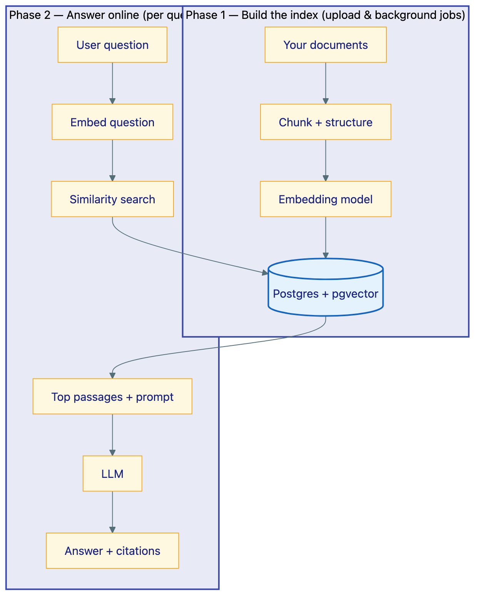
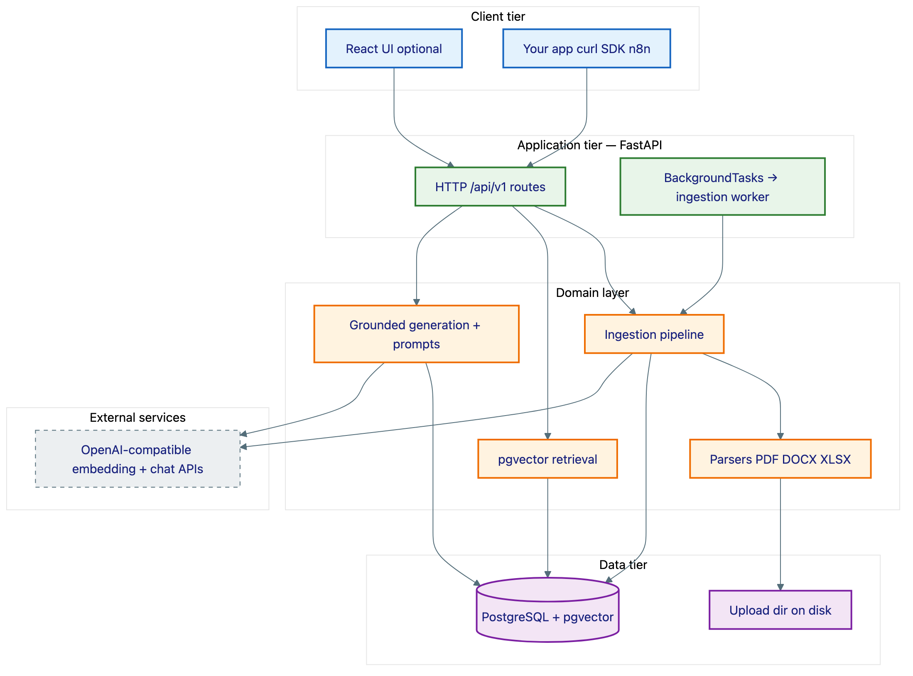
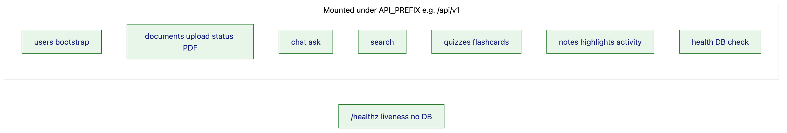
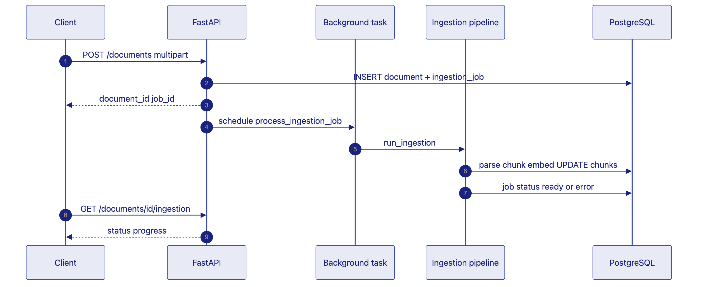
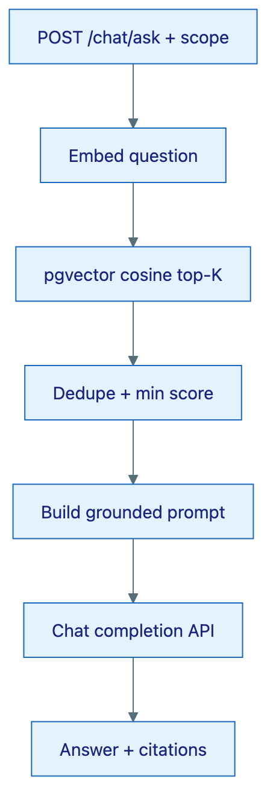
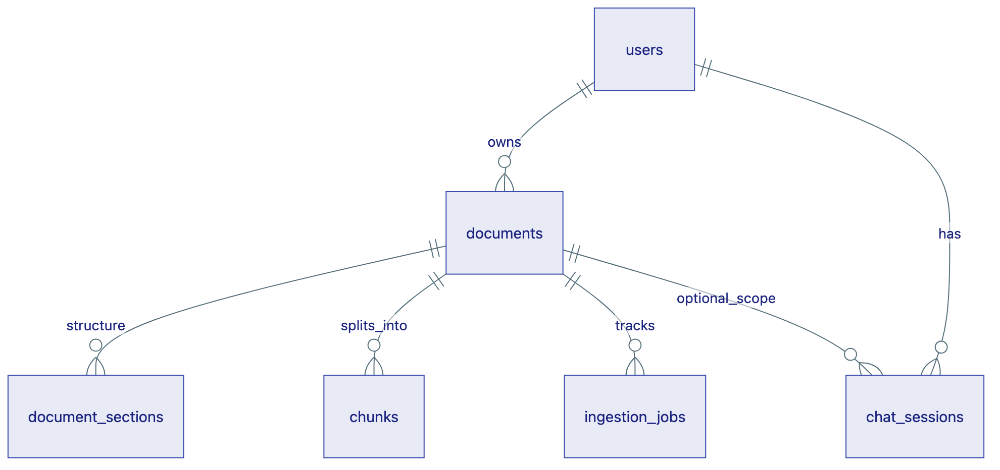
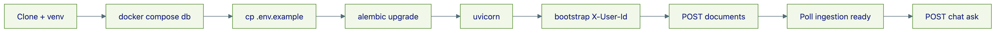

# OpenRAG

**Open, self-hostable retrieval-augmented generation (RAG)** for *your* private documents. Upload **PDF**, **Word (`.docx`)**, or **Excel (`.xlsx`)**, get **structure-aware chunks** and **vector search** (Postgres **pgvector**), then ask questions, search, generate quizzes and flashcards, and take notes—**with citations** back to the source when the system finds relevant text.

Run it as a **FastAPI** backend only, or pair it with the included **React + Vite** UI.

---

## Table of contents

1. [What is RAG? (start here)](#what-is-rag-start-here)  
2. [Why use RAG instead of “just asking ChatGPT”?](#why-use-rag-instead-of-just-asking-chatgpt)  
3. [What OpenRAG gives you](#what-openrag-gives-you)  
4. [Who this is for](#who-this-is-for)  
5. [Use cases and examples](#use-cases-and-examples)  
6. [How OpenRAG works (architecture)](#how-openrag-works-architecture)  
7. [Key ideas (mini glossary)](#key-ideas-mini-glossary)  
8. [Tech stack](#tech-stack)  
9. [Repository layout](#repository-layout)  
10. [Quick start: clone to running app](#quick-start-clone-to-running-app)  
11. [Configuration (what each knob does)](#configuration-what-each-knob-does)  
12. [Using the API (step-by-step with curl)](#using-the-api-step-by-step-with-curl)  
13. [Frontend (optional UI)](#frontend-optional-ui)  
14. [Deployment](#deployment)  
15. [Testing and quality](#testing-and-quality)  
16. [Design choices and tradeoffs](#design-choices-and-tradeoffs)  
17. [Troubleshooting](#troubleshooting)  
18. [Contributing](#contributing)  
19. [Community guidelines](#community-guidelines)  
20. [License](#license)

---

## What is RAG? (start here)

A **large language model (LLM)** is good at language, but it does **not** automatically know *your* private PDFs, your team wiki, or yesterday’s policy doc—unless you paste them in every time.

**Retrieval-augmented generation (RAG)** is a pattern that does two things before the model answers:

1. **Retrieve** — Find the most relevant passages from *your* indexed documents (usually with **semantic search** over **embeddings**).  
2. **Generate** — Ask the LLM to answer **using only (or primarily) those passages**, and ideally **point to** where the text came from.

Think of it as: **librarian first, writer second**. The librarian pulls books off the shelf; the writer summarizes what those pages actually say.

### RAG in two phases



*Same **vector store** serves both phases: you write embeddings during ingestion, then read the nearest neighbors at query time. The LLM only sees what retrieval returned—plus your question—not your whole file dump.*

---

## Why use RAG instead of “just asking ChatGPT”?

**Building and running your own RAG** is not only about better answers over private documents—it is a foundation you control. You can plug the same retrieval-and-generation pipeline into **your own agents**, **chatbots**, **internal tools**, or **customer-facing applications**, with **your** authentication, data policies, and UX—instead of being limited to a vendor’s chat window.

| Approach | Strength | Weakness |
|----------|-----------|----------|
| **ChatGPT alone** | Fast, general knowledge | No access to your private files; may **guess** when it should say “I don’t know” |
| **Paste whole doc every time** | Simple | Breaks context limits; doesn’t scale; hard to search many files |
| **RAG** | Answers grounded in **your** corpus; can cite **snippets** | Needs ingestion pipeline, storage, and tuning |

OpenRAG is built around **grounding**: the model is steered toward retrieved text, and the API can surface **low confidence** when retrieval is weak—so you are less likely to get a confident fiction.

---

## What OpenRAG gives you

- **Grounded Q&A** — Chat asks the retriever first; answers tie back to **citations** and passages when evidence exists.  
- **Semantic search** — Query your library by meaning, not only keywords.  
- **Scoped retrieval** — Limit chat or search to one **document**, section, or page range.  
- **Learning-style features** — Quizzes, flashcards, notes, highlights, activity—useful for study and review workflows.  
- **Pluggable file types** — New formats register in one place ([`app/services/parsing/registry.py`](app/services/parsing/registry.py)) without rewriting routes.  
- **OpenAI-compatible APIs** — Point **embeddings** and **chat** at OpenAI or any compatible HTTP API; use **mock** providers for offline development.  
- **One database** — Postgres holds metadata, chunks, and **pgvector** embeddings.  
- **Optional UI** — React app under [`frontend/`](frontend/) with library, reader, chat, and more.

**Supported upload types today:** **PDF** (PyMuPDF, optional Tesseract OCR), **`.docx`** (python-docx), **`.xlsx`** (openpyxl). See `GET /api/v1/documents/supported-formats` after the server starts.

---

## Who this is for

- **Students and researchers** who want answers **with sources** from papers and notes.  
- **Teams** experimenting with **private** document Q&A without sending file contents to a vendor UI.  
- **Developers** who want a **real codebase** to fork: API-first, clear layers, tests, and extension points.  
- **Anyone new to RAG** who learns best by **running** a system and reading **one** coherent project end-to-end.

---

## Use cases and examples

**Study and exam prep**  
Upload a textbook chapter (PDF) or lecture outline (DOCX). Ask: “What are the main causes of X according to this chapter?” Generate a **quiz** on the same scope and review **flashcards**.

**Policy and compliance reading**  
Upload the employee handbook. Ask: “What is the remote work policy?” The answer should cite handbook passages; if retrieval is weak, the response should say so instead of inventing a policy.

**Spreadsheets**  
Upload an **`.xlsx`** export. Chunks follow sheets/pages from parsing; you can ask questions scoped to that document. (The UI shows **extracted text** for Office files—not a full Excel grid renderer.)

**API-only automation**  
Integrate from Python, n8n, or another backend: bootstrap a user, upload, poll ingestion, then call `/chat/ask` or `/search`.

---

## How OpenRAG works (architecture)

This section follows the same README pattern as projects like [talentmatch-ai](https://github.com/yeluru/talentmatch-ai): **one diagram per idea**, **PNG for pixel-stable rendering on GitHub**, plus a **short caption**. Sources live in [`docs/diagrams/sources/`](docs/diagrams/sources/); regenerate PNGs with [`scripts/render_diagrams.sh`](scripts/render_diagrams.sh) (see [`docs/diagrams/README.md`](docs/diagrams/README.md)).

### System architecture



*Three-tier shape: **browsers and integrators** talk to **FastAPI**; **domain services** own parsing, vectors, and LLM calls; **Postgres + files** persist everything. Embeddings and chat completions go out to **HTTP APIs** you configure (`EMBEDDING_*`, `LLM_*`) or **mock** providers for local dev.*

### API and route surface



*`/healthz` is separate for load balancers; everything else lives under the versioned prefix. OpenAPI lives at `/docs`.*

### Ingestion pipeline (internal flow)

When you upload a file:

1. The API stores the **file** and creates **`Document`** + **`IngestionJob`** rows.  
2. A **background task** runs the ingestion pipeline (`app/workers/ingestion_worker.py` → `app/services/ingestion/pipeline.py`).  
3. The right **parser** runs (registry picks by MIME type / extension).  
4. **Structure inference** (`structure_extractor.py`) helps respect headings and sections when possible.  
5. **Chunking** (`app/rag/chunkers/structure_aware.py`) splits text into pieces suitable for embedding and retrieval.  
6. Each chunk is **embedded** and stored with a **vector** on the `chunks` table (pgvector).  
7. The job moves to **ready** (or records an error you can read from the API).


*Linear pipeline you can trace in code; swapping **BackgroundTasks** for a queue worker would keep the same steps.*

### Ingestion sequence (who calls whom)



*The client gets IDs immediately; heavy work finishes **asynchronously** in the API process.*

### RAG query path (grounded answer)

1. The API **embeds the question** (same embedding model as chunks).  
2. **pgvector** similarity search pulls the top‑K chunks, with **filters** (e.g. one document).  
3. **Deduping** and **score thresholds** reduce noise (`RETRIEVAL_*` settings).  
4. The **LLM** receives a prompt with those passages and is asked to answer **from that context**.  
5. The response includes **citations** (chunk references) so clients can show “where this came from.”



*Retrieval is explicit: if scores are weak, the product can say so instead of inventing text.*

### Core data model (simplified ERD)



*Real schema adds `chat_messages`, quizzes, flashcards, notes, highlights, and more; this is the **RAG spine**—users, documents, structure, vectors, and jobs.*

### Developer journey (first successful ask)



*Same path you can script with **curl** or any HTTP client; see [Using the API](#using-the-api-step-by-step-with-curl) below.*

---

## Key ideas (mini glossary)

| Term | Plain English |
|------|----------------|
| **Chunk** | A small piece of text (often a paragraph or section) used as the unit of search and citation. |
| **Embedding** | A numeric vector representing “meaning” of text; similar ideas get similar vectors. |
| **Vector database / pgvector** | Storage and similarity search over embeddings inside Postgres. |
| **Retriever** | The component that picks which chunks to show the LLM for this question. |
| **Grounding** | Tying the model’s answer to retrieved text instead of free-form world knowledge. |
| **Citation** | A pointer from an answer back to a specific chunk (and thus back to a document and location). |
| **Ingestion** | The offline process that parses files, chunks them, and builds the index. |
| **Scope** | Restricting retrieval to a document, section, or page range so answers stay on-topic. |
| **Mock provider** | Fake embeddings/LLM for local dev without API keys (not semantically meaningful). |

---

## Tech stack

| Layer | Technology |
|--------|------------|
| API | FastAPI, Pydantic v2, Uvicorn |
| Database | PostgreSQL, **pgvector**, SQLAlchemy 2 (async), Alembic |
| Parsing | PyMuPDF (PDF + optional Tesseract OCR); **python-docx**; **openpyxl** |
| Embeddings / LLM | httpx → OpenAI-compatible JSON APIs |
| Frontend | React 18, Vite 5, Tailwind, TypeScript |

---

## Repository layout

```
app/
  api/routes/       # HTTP routers (documents, chat, search, quizzes, …)
  core/             # Settings, logging, security helpers
  db/models/        # SQLAlchemy models
  services/         # Ingestion, parsing, embeddings, retrieval, generation, documents
  rag/              # Chunkers, prompts, citation helpers
  workers/          # Background ingestion entrypoint
alembic/            # Migrations
frontend/           # Vite + React UI (optional)
scripts/            # render_start.sh, self_test_features.py, reset helpers
```

Files you will touch most often:

- **Config:** [`app/core/config.py`](app/core/config.py), [`.env.example`](.env.example)  
- **New file types:** [`app/services/parsing/registry.py`](app/services/parsing/registry.py), [`app/services/parsing/base.py`](app/services/parsing/base.py)  
- **Retrieval tuning:** [`app/services/retrieval/pgvector_retriever.py`](app/services/retrieval/pgvector_retriever.py) + `RETRIEVAL_*` env vars  
- **Prompts:** [`app/rag/prompts/`](app/rag/prompts/)  

---

## Quick start: clone to running app

### Requirements

- **Python 3.11+** (see [`runtime.txt`](runtime.txt) for Render’s pinned example: 3.12.8)  
- **Node 18+** if you use the frontend  
- **Docker** (recommended) or your own Postgres **13+** with `CREATE EXTENSION vector`

### 1. Clone and create a virtual environment

```bash
git clone <your-repo-url> openrag
cd openrag
python3 -m venv .venv
source .venv/bin/activate    # Windows: .venv\Scripts\activate
pip install --upgrade pip
pip install -r requirements.txt
```

### 2. Start Postgres (Docker Compose)

```bash
docker compose up -d
```

This repo maps Postgres to host port **5433** so it does **not** fight with a local Postgres on **5432**. If tools connect to `localhost:5432` by mistake, you will see errors about the wrong database user—always align `.env` with the port you intend.

### 3. Configure environment

```bash
cp .env.example .env
```

For a **first run without cloud API keys**, you can keep:

- `EMBEDDING_PROVIDER=mock`  
- `LLM_PROVIDER=mock`  

You will get **non-semantic** retrieval scores and stub answers—fine for wiring up the stack, **not** for judging answer quality. For real RAG, set providers to `openai` (or compatible) and add keys.

Ensure **`POSTGRES_PORT=5433`** matches Compose (already the default in `.env.example`).

### 4. Run migrations and the API

```bash
alembic upgrade head
uvicorn app.main:app --reload --host 0.0.0.0 --port 8000
```

**Useful URLs**

| URL | Purpose |
|-----|---------|
| http://localhost:8000/docs | Interactive OpenAPI (Swagger) |
| http://localhost:8000/redoc | Alternative API docs |
| `GET /healthz` | **Liveness only** — no DB; use for load balancers |
| `GET /api/v1/health` | App + **database** check |
| `GET /api/v1/documents/supported-formats` | MIME types and extensions accepted for upload |

### 5. (Optional) Run the React UI

```bash
cd frontend
cp .env.example .env   # optional tweaks
npm install
npm run dev
```

Vite serves the UI (default **http://localhost:5173**) and **proxies** `/api` to **http://127.0.0.1:8000** unless you set `VITE_PROXY_TARGET`. The UI talks to `/api/v1` via `VITE_API_PREFIX`.

---

## Configuration (what each knob does)

All backend variables are documented in [`.env.example`](.env.example). Highlights:

| Area | Variables | Notes |
|------|-----------|--------|
| **Database** | `DATABASE_URL` **or** `POSTGRES_*` | If `DATABASE_URL` is set (e.g. Render), `POSTGRES_*` is ignored. URLs may start with `postgres://` or `postgresql://`. |
| **API** | `API_PREFIX`, `DEBUG`, `LOG_JSON` | `API_PREFIX` defaults to `/api/v1`. |
| **Security** | `SERVICE_API_KEY` | When set, clients send `X-Api-Key` on protected routes. **`/healthz` stays open.** |
| **Browser clients** | `CORS_ORIGINS` | Comma-separated origins, e.g. `http://localhost:5173,https://myapp.com`. Empty disables CORS middleware. |
| **Uploads** | `UPLOAD_DIR`, `MAX_UPLOAD_MB` | Paths are resolved relative to the **repo root**. On cloud PaaS, disk is often **ephemeral** unless you attach persistent storage. |
| **OCR** | `PDF_OCR_*` | Needs **Tesseract** installed locally; often **off** on simple cloud runtimes (see [`DEPLOY_RENDER.md`](DEPLOY_RENDER.md)). |
| **Embeddings** | `EMBEDDING_PROVIDER`, `EMBEDDING_API_*`, `EMBEDDING_MODEL`, … | Use `mock` only for plumbing tests. Real RAG needs real embeddings. |
| **LLM** | `LLM_PROVIDER`, `LLM_API_*`, `LLM_MODEL`, … | Same story: `mock` for smoke tests, real provider for quality. |
| **Retrieval** | `RETRIEVAL_DEFAULT_TOP_K`, `RETRIEVAL_MIN_SCORE_COSINE`, `RETRIEVAL_DEDUPE_OVERLAP_RATIO` | Tune precision vs recall. With `mock` embeddings, scores are not meaningful—lower thresholds only for local experiments. |
| **Debug** | `INCLUDE_RETRIEVAL_DEBUG` | Extra retrieval detail in responses when enabled. |

---

## Using the API (step-by-step with curl)

Replace hosts/ports if yours differ. The API expects a stable **`X-User-Id`** UUID per logical user.

### 1. Create a user id and bootstrap

```bash
export USER_ID="$(python3 -c 'import uuid; print(uuid.uuid4())')"
curl -s -X POST "http://127.0.0.1:8000/api/v1/users/bootstrap" \
  -H "X-User-Id: $USER_ID" \
  -H "Content-Type: application/json"
```

If you set `SERVICE_API_KEY` in `.env`, add:

`-H "X-Api-Key: your-key"`

### 2. Upload a document

Use **`@`** so curl sends the file bytes (not a string path):

```bash
curl -s -X POST "http://127.0.0.1:8000/api/v1/documents" \
  -H "X-User-Id: $USER_ID" \
  -F "file=@/path/to/your/document.pdf"
```

Save `document_id` from the JSON response.

### 3. Wait until ingestion is ready

```bash
export DOC_ID="<paste-document-id-here>"
curl -s "http://127.0.0.1:8000/api/v1/documents/$DOC_ID/ingestion" \
  -H "X-User-Id: $USER_ID" | python3 -m json.tool
```

Wait until `"status": "ready"` (or inspect `error_message` if it failed).

### 4. Ask a grounded question

```bash
curl -s -X POST "http://127.0.0.1:8000/api/v1/chat/ask" \
  -H "X-User-Id: $USER_ID" \
  -H "Content-Type: application/json" \
  -d '{
    "question": "What is this document mainly about?",
    "mode": "concise_summary",
    "scope": { "document_id": "'"$DOC_ID"'" }
  }' | python3 -m json.tool
```

The response includes **citations** pointing at chunks; read them like footnotes.

---

## Frontend (optional UI)

The UI is optional: everything important goes through the API.

**Features (high level):** library and upload, **reader** (PDF in an embedded viewer; Word/Excel show **extracted text** by page/sheet because browsers cannot render Office like PDF), chat, quizzes, highlights, notes, settings, theme switching, and a simple **landing** flow.

**Env:** [`frontend/.env.example`](frontend/.env.example) — `VITE_API_PREFIX`, optional `VITE_API_KEY`, optional `VITE_PROXY_TARGET`.

---

## Deployment

For **[Render.com](https://render.com)** (Postgres + web service, migrations on start, health checks), follow **[DEPLOY_RENDER.md](DEPLOY_RENDER.md)** and optional [`render.yaml`](render.yaml) Blueprint.

---

## Testing and quality

```bash
# Fast: no live Postgres / OpenAI required
pytest -q -m "not integration"

# Full suite: needs DB per .env and usually real keys for integration paths
pytest -q

# Integration only, against a running server
OPENRAG_TEST_BASE_URL=http://127.0.0.1:8000 pytest tests/test_rag_integration.py -m integration -v
```

See [`tests/conftest.py`](tests/conftest.py) for **`OPENRAG_TEST_*`** variables when `SERVICE_API_KEY` is enabled.

**HTTP smoke script:** [`scripts/self_test_features.py`](scripts/self_test_features.py) — uses env vars prefixed with **`OPENRAG_`** (see the file docstring).

---

## Design choices and tradeoffs

**Background tasks vs a job queue**  
Ingestion runs via FastAPI **BackgroundTasks** in the same process. That keeps the repo simple to clone and run; it means **heavy uploads compete with API traffic** and **in-flight jobs are lost** if the process restarts. A natural contribution is plugging the same `run_ingestion` pipeline into **Celery / RQ / ARQ** or a cloud task queue.

**Postgres-only vectors**  
pgvector avoids running a second database for many deployments. At very large scale you might shard or add a dedicated vector engine; the retrieval interface is the place to evolve that.

**Header-based user identity**  
`X-User-Id` is intentional for API-first integration. It is **not** full user authentication. For production on the public internet, place the API behind **OAuth2**, **API gateways**, or mutual TLS, and map identities server-side.

**Office “preview” in the UI**  
`.docx` / `.xlsx` are rendered as **indexed text**, not pixel-perfect Office. Ingestion and RAG still use the same extracted text the reader shows.

---

## Troubleshooting

| Symptom | Likely cause | What to try |
|---------|----------------|-------------|
| `role "openrag" does not exist` | App hitting **wrong Postgres** (e.g. port **5432** Homebrew vs **5433** Docker) | Match `POSTGRES_PORT` / `DATABASE_URL` to the instance you started |
| Alembic or app sees wrong config | Running commands outside repo root | Run from repo root; settings load **repo `.env`** by path |
| Low similarity scores, nonsense retrieval | `EMBEDDING_PROVIDER=mock` | Switch to real embeddings for meaningful search |
| Answers say `[mock]` or feel empty | `LLM_PROVIDER=mock` | Set a real LLM provider and key |
| OCR does nothing | Tesseract not installed or disabled | Install Tesseract; set `PDF_OCR_ENABLED=true` |
| `Unsupported file type` | Format not registered | Check `GET /documents/supported-formats`; add a parser (see Contributing) |

**Reset local data (truncate, keep schema):**

```bash
docker compose exec -T db psql -U openrag -d openrag \
  -c "TRUNCATE TABLE users RESTART IDENTITY CASCADE;"
```

Or use [`scripts/reset_data.sql`](scripts/reset_data.sql). **Nuclear option:** `docker compose down -v`, bring DB back, then `alembic upgrade head`.

**Migrating from older clones** that used a different DB role name: either align `.env` with your existing database or wipe volumes and recreate so credentials match [`docker-compose.yml`](docker-compose.yml).

---

## Contributing

We want this to be a friendly **open-source** project. You do not need to be an ML researcher to help.

**Start here:** **[CONTRIBUTING.md](CONTRIBUTING.md)** (dev setup, tests, PR expectations).  
**Community standards:** **[CODE_OF_CONDUCT.md](CODE_OF_CONDUCT.md)** (Contributor Covenant 2.1).

### Ways to contribute

1. **Documentation** — Fix confusing steps, add examples, translate sections (keep technical terms accurate).  
2. **Parsers** — Add `.md`, `.csv`, `.pptx`, or scanned-image pipelines; register via `register_parser`.  
3. **Retrieval** — Better deduping, hybrid search (keyword + vector), metadata filters, reranking.  
4. **Prompts** — Safer defaults, clearer “insufficient evidence” behavior, structured JSON outputs.  
5. **Frontend** — Accessibility, reader UX, mobile layout.  
6. **Ops** — Docker Compose profiles, Helm charts, example Terraform, CI workflows.  
7. **Tests** — Unit tests for edge cases; integration tests with fixtures.

### Adding a new document format

1. Implement `DocumentParser` in [`app/services/parsing/base.py`](app/services/parsing/base.py) returning a `ParsedDocument`.  
2. Call `register_parser(...)` from your module with **canonical MIME**, **accepted MIME types**, **extensions**, and a **factory**.  
3. Import your module from the builtin loader in [`registry.py`](app/services/parsing/registry.py) (or ensure it is imported at startup).  
4. Add tests under [`tests/`](tests/) (see [`tests/test_parser_registry.py`](tests/test_parser_registry.py)).  
5. Run `pytest -q -m "not integration"` before opening a PR.

### Pull request checklist

- **Small, focused diffs** — One feature or fix per PR when possible.  
- **Tests** — For logic changes, add or update tests.  
- **Docs** — Update README or `.env.example` if behavior or configuration changed.  
- **Describe the “why”** — Help reviewers understand user-visible impact.

If you are unsure, open an issue with your idea; we can point you to the right files. For maintainer-facing process and security reporting, see **[CONTRIBUTING.md](CONTRIBUTING.md)**.

---

## Community guidelines

Participation is governed by the **[Contributor Covenant Code of Conduct](CODE_OF_CONDUCT.md)**. Please read it before opening issues, pull requests, or discussions.

---

## License

OpenRAG is licensed under the **[MIT License](LICENSE)**.

Copyright (c) 2025 OpenRAG contributors. Unless you explicitly state otherwise, any contribution intentionally submitted for inclusion in this project shall be under the same license.

---

**Welcome aboard.** If OpenRAG helps you learn RAG or ship a project, consider starring the repo and sharing what you built.
