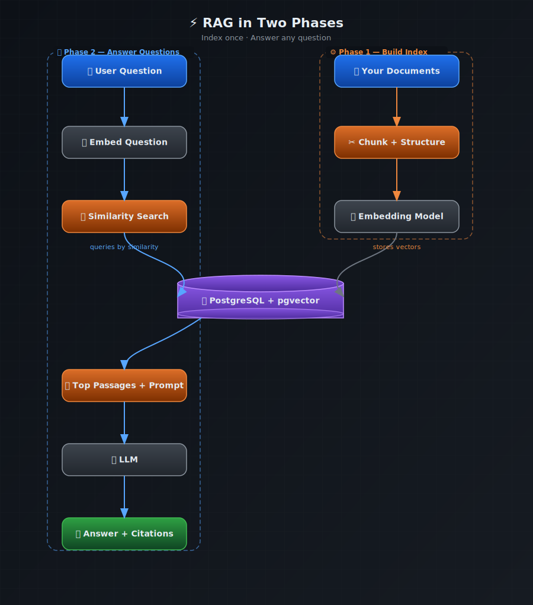
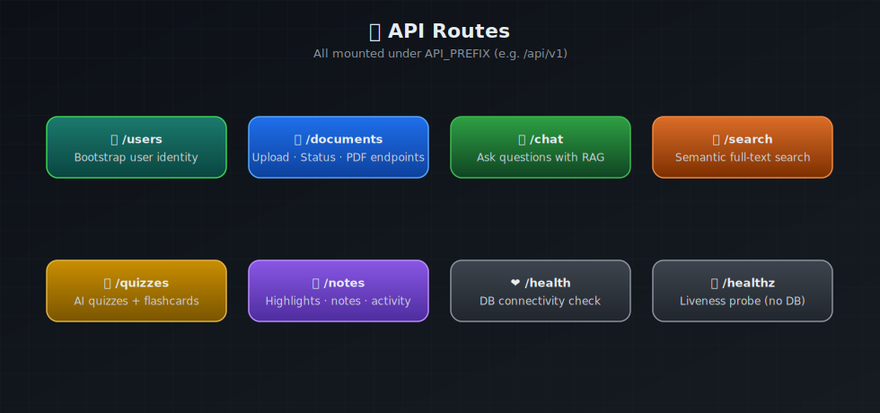
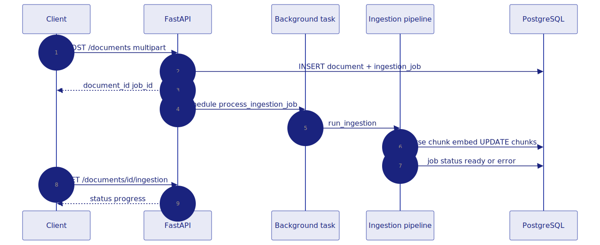
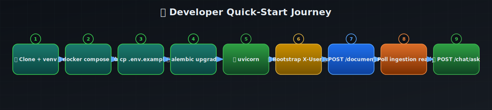

<div align="center">

# 🔍 OpenRAG

**Self-hostable, batteries-included Retrieval-Augmented Generation for your private documents.**

Upload a PDF, Word doc, or spreadsheet. Ask questions. Get grounded answers — with citations pointing back to the exact text the model used.

[](https://www.python.org/)
[](https://fastapi.tiangolo.com/)
[](https://github.com/pgvector/pgvector)
[](LICENSE)
[](http://localhost:8000/docs)

</div>

---

## Table of Contents

1. [What is RAG? (start here, freshers welcome)](#-what-is-rag-start-here)
2. [Why build your own instead of "just using ChatGPT"?](#-why-build-your-own)
3. [What OpenRAG gives you](#-what-openrag-gives-you)
4. [How it works — architecture in pictures](#-how-it-works--architecture-in-pictures)
5. [Key vocabulary](#-key-vocabulary)
6. [Tech stack](#-tech-stack)
7. [Repository layout](#-repository-layout)
8. [Quick start: zero to running in 5 minutes](#-quick-start-zero-to-running-in-5-minutes)
9. [Verify your setup (smoke test)](#-verify-your-setup)
10. [API walkthrough with real curl examples](#-api-walkthrough)
11. [Configuration reference](#%EF%B8%8F-configuration-reference)
12. [Frontend (optional React UI)](#-frontend-optional-react-ui)
13. [Deployment on Render](#-deployment-on-render)
14. [Testing](#-testing)
15. [Design decisions and trade-offs](#-design-decisions-and-trade-offs)
16. [Troubleshooting](#-troubleshooting)
17. [FAQ](#-faq)
18. [Contributing](#-contributing)
19. [License](#-license)

---

## 🧠 What is RAG? (start here)

If you are new to RAG — or to AI systems in general — this section is for you. Read it carefully; everything else in this project builds on these ideas.

### The problem with LLMs and private knowledge

A large language model (LLM) like GPT-4 was trained on text from the internet and books. It knows a lot — but it does **not** know about your company's internal policy document, the research paper you downloaded yesterday, or your 200-page product manual. If you ask it a question about those, it will either say "I don't know" or, worse, make something up that sounds plausible.

### The librarian analogy

Imagine you walk into a library and ask a question. A great librarian does two things:

1. **Retrieves** the right books — searches the shelves, pulls the most relevant pages.
2. **Explains** the answer in their own words — using *those pages* as the source.

RAG does exactly this, but with software:

1. **Retrieve** — Search your indexed documents for the passages most relevant to the question.
2. **Generate** — Hand those passages to the LLM and ask it to answer *using only what it was given*.

The key insight: the LLM does not need to "remember" your document. It only needs to *read* the relevant excerpt at the moment of answering — just like a librarian reading a paragraph aloud.

### RAG in two phases



**Phase 1 — Build the index (done once per document):**

```
Your PDF → parse into text → split into chunks → embed each chunk → store vectors in Postgres
```

**Phase 2 — Answer a question (done per query):**

```
Question → embed question → find most similar chunks → build prompt with those chunks → LLM answers → return answer + citations
```

The same **PostgreSQL + pgvector** database serves both phases. Ingestion writes vectors in; query time reads the nearest neighbors out.

### Why this approach works

- The LLM only sees what retrieval returned — it cannot hallucinate about content it was never shown.
- Citations let you verify every claim. If the retriever found nothing relevant, the system can say "not enough evidence" instead of inventing an answer.
- You never have to paste your whole document into a chat box again.

---

## 💡 Why Build Your Own?

| Approach | Strength | Weakness |
|----------|----------|----------|
| **ChatGPT / Claude directly** | Instant, powerful | Doesn't know your private files; may hallucinate confidently |
| **Paste the document every time** | Simple | Hits context limits; doesn't scale; no multi-doc search |
| **Vendor RAG products** | Managed | Black-box; costly at scale; your data leaves your control |
| **OpenRAG (self-hosted)** | Full control, citable answers, extensible | Needs an embedding API + Postgres to run |

**When OpenRAG is the right choice:**
- You have private documents that must not leave your infrastructure.
- You want citable, grounded answers (not creative summaries).
- You want to *understand* how RAG works by reading a real, complete codebase.
- You are building a product that needs a RAG backend you can fork and own.

---

## ✨ What OpenRAG Gives You

**Core RAG capabilities:**
- Upload **PDF**, **Word (.docx)**, or **Excel (.xlsx)** — parsed, chunked, and embedded automatically.
- **Grounded Q&A** — answers tied to specific passages with citations.
- **Semantic search** — find content by meaning, not just keywords.
- **Scoped retrieval** — limit chat or search to one document, section, or page range.

**Learning and study tools (built on the same RAG spine):**
- **Quizzes** — generate multiple-choice or open-ended questions from any document.
- **Flashcards** — auto-generated term/definition pairs.
- **Notes and highlights** — save excerpts and annotations per document.
- **Activity feed** — track what you studied and when.

**Developer-friendly design:**
- **OpenAPI docs** at `/docs` — try every endpoint in the browser.
- **OpenAI-compatible** embedding and chat APIs — swap any compatible provider (Ollama, Mistral, Together AI, etc.).
- **Mock providers** — run the full stack offline without API keys (semantic quality not guaranteed).
- **One database** — Postgres stores metadata, file chunks, vectors, sessions, and learning data.
- **Pluggable parsers** — add a new file format by registering one class.
- **Optional React UI** — library, reader, chat, quizzes, notes — all wired to the API.

---

## 🏗️ How It Works — Architecture in Pictures

### System architecture



Five layers, top to bottom:

| Layer | What lives here |
|-------|-----------------|
| **Client Tier** | React UI (optional) · your app · curl · n8n workflows |
| **Application Tier** | FastAPI `/api/v1` routes · background ingestion worker · file parsers |
| **Domain Layer** | pgvector retrieval · grounded prompt builder |
| **External Services** | OpenAI-compatible embedding API · chat completion API |
| **Data Tier** | PostgreSQL + pgvector · uploaded files on disk |

### API surface



`/healthz` is intentionally separate and unauthenticated — load balancers and health checks call it without needing credentials. Everything useful lives under `/api/v1`.

### Ingestion pipeline


When you upload a file, the API returns immediately with a `document_id` and `job_id`. The pipeline runs in the background:

1. File is saved to disk; a `Document` and `IngestionJob` row are created in Postgres.
2. The right **parser** runs (MIME type → registry lookup).
3. **Structure inference** detects headings, sections, and page boundaries.
4. **Chunker** splits text into retrieval-ready pieces.
5. Each chunk is **embedded** and its vector stored in pgvector.
6. The job status moves to `ready` (or records an `error_message`).

### Ingestion sequence



The client polls `GET /documents/{id}/ingestion` to know when to start asking questions.

### RAG query path



Eight steps from question to grounded answer:

| Step | What happens |
|------|-------------|
| 1 | `POST /chat/ask` arrives with question and optional scope |
| 2 | Question is embedded using the same model as the chunks |
| 3 | pgvector cosine similarity search finds top-K chunks |
| 4 | PostgreSQL returns matching chunk text and metadata |
| 5 | Deduplicate + apply minimum score filter |
| 6 | Build a grounded prompt: "Answer using only these passages:" |
| 7 | LLM generates the answer |
| 8 | Response returns answer + source citations |

### Core data model



The RAG spine is: **users → documents → sections → chunks ↔ vectors**. Everything else (sessions, quizzes, flashcards, notes, highlights) hangs off documents.

### Developer journey



Clone → configure → migrate → upload → wait for `ready` → ask a question. The journey below follows this path exactly.

---

## 📖 Key Vocabulary

You will see these terms throughout the code and API responses.

| Term | Plain English |
|------|---------------|
| **Chunk** | A small passage of text (typically one paragraph or section). The basic unit of search and citation. |
| **Embedding** | A list of numbers (a vector) that captures the *meaning* of a chunk or question. Similar meanings → similar vectors. |
| **pgvector** | A Postgres extension that stores and searches vectors efficiently using cosine similarity. |
| **Retriever** | The component that runs the similarity search and decides which chunks to hand to the LLM. |
| **Grounding** | Constraining the LLM's answer to retrieved text rather than its training knowledge. |
| **Citation** | A pointer from an answer sentence back to a specific chunk, document, and location. |
| **Ingestion** | The offline pipeline that parses a file, chunks it, embeds each chunk, and stores everything in Postgres. |
| **Scope** | Limiting retrieval to a specific document, section, or page range so the answer stays on-topic. |
| **Mock provider** | A fake embedding/LLM for local development. Fast and free, but not semantically meaningful. |
| **top-K** | The number of most-similar chunks retrieved per query. Controlled by `RETRIEVAL_DEFAULT_TOP_K`. |

---

## 🛠️ Tech Stack

| Layer | Technology | Why |
|-------|------------|-----|
| **API** | FastAPI · Pydantic v2 · Uvicorn | Async, typed, self-documenting |
| **Database** | PostgreSQL · pgvector · SQLAlchemy 2 (async) · Alembic | One DB for data + vectors + migrations |
| **PDF parsing** | PyMuPDF (fitz) · Tesseract OCR (optional) | Fast, handles scanned pages with OCR |
| **Word / Excel** | python-docx · openpyxl | Native parsing of Office formats |
| **Embeddings / LLM** | httpx → any OpenAI-compatible API | Swap providers without code changes |
| **Frontend** | React 18 · Vite 5 · Tailwind · TypeScript | Modern, fast, optional |

---

## 📁 Repository Layout

```
openrag/
├── app/
│   ├── api/routes/          # HTTP route handlers
│   │   ├── chat.py          #   /chat/ask, /chat/sessions
│   │   ├── documents.py     #   upload, list, delete, ingestion status
│   │   ├── search.py        #   semantic search
│   │   ├── quizzes.py       #   quiz generation and attempts
│   │   ├── flashcards.py    #   flashcard sets
│   │   ├── notes.py         #   note CRUD
│   │   ├── highlights.py    #   highlight CRUD
│   │   ├── users.py         #   bootstrap user
│   │   └── health.py        #   /healthz + /api/v1/health
│   ├── core/
│   │   ├── config.py        #   ← all config lives here (pydantic-settings)
│   │   ├── logging.py
│   │   └── security.py      #   X-Api-Key middleware
│   ├── db/
│   │   ├── models/          #   SQLAlchemy ORM models
│   │   └── session.py       #   async engine + session factory
│   ├── services/
│   │   ├── parsing/         #   parser registry + PDF/DOCX/XLSX parsers
│   │   ├── ingestion/       #   pipeline.py — the ingestion orchestrator
│   │   ├── embeddings/      #   openai.py + mock.py providers
│   │   ├── retrieval/       #   pgvector_retriever.py — cosine search + filters
│   │   ├── generation/      #   LLM call + response parsing
│   │   └── documents.py     #   document service (CRUD + ingestion status)
│   ├── rag/
│   │   ├── chunkers/        #   structure_aware.py — paragraph-level chunking
│   │   ├── prompts/         #   system + grounded answer prompt templates
│   │   └── citations.py     #   chunk-to-citation mapping
│   ├── workers/
│   │   └── ingestion_worker.py  # background task entry point
│   └── main.py              #   FastAPI app factory
├── alembic/                 # migrations (run `alembic upgrade head`)
├── frontend/                # React + Vite UI (optional)
├── scripts/
│   ├── render_start.sh      #   migrate + start (used by Render)
│   └── self_test_features.py  # HTTP smoke test
├── tests/
│   ├── test_rag_integration.py  # end-to-end RAG tests
│   └── conftest.py
├── docs/diagrams/svg/       # architecture diagrams (this README uses these)
├── docker-compose.yml       # Postgres with pgvector on port 5433
├── .env.example             # all config variables with comments
├── DEPLOY_RENDER.md         # cloud deployment guide
└── requirements.txt
```

**Files you will touch most often:**

| Task | File |
|------|------|
| Change any config | [`app/core/config.py`](app/core/config.py) + [`.env`](.env.example) |
| Add a new file format | [`app/services/parsing/registry.py`](app/services/parsing/registry.py) |
| Tune retrieval | [`app/services/retrieval/pgvector_retriever.py`](app/services/retrieval/pgvector_retriever.py) |
| Edit LLM prompt | [`app/rag/prompts/`](app/rag/prompts/) |
| Add an API route | [`app/api/routes/`](app/api/routes/) + register in `app/main.py` |

---

## 🚀 Quick Start: Zero to Running in 5 Minutes

### Prerequisites

- **Python 3.11+** — check with `python3 --version`
- **Docker** — for Postgres with pgvector (or bring your own Postgres 13+ with the `vector` extension)
- **Node 18+** — only if you want the React UI

### Step 1 — Clone and install

```bash
git clone https://github.com/yeluru/openrag.git
cd openrag
python3 -m venv .venv
source .venv/bin/activate          # Windows: .venv\Scripts\activate
pip install --upgrade pip
pip install -r requirements.txt
```

### Step 2 — Start Postgres

```bash
docker compose up -d
```

This starts **PostgreSQL 16 with pgvector** on host port **5433** (not 5432, to avoid collisions with any local Postgres installation).

Verify it's up:

```bash
docker compose ps   # should show db running
```

### Step 3 — Configure your environment

```bash
cp .env.example .env
```

Open `.env`. For a **first run without any API keys**, the defaults work out of the box:

```env
EMBEDDING_PROVIDER=mock     # random vectors — no key needed
LLM_PROVIDER=mock           # stub answers — no key needed
POSTGRES_PORT=5433          # matches docker-compose.yml
```

> **Want real RAG quality?** Set `EMBEDDING_PROVIDER=openai`, `LLM_PROVIDER=openai`, and add `EMBEDDING_API_KEY` + `LLM_API_KEY`. Any OpenAI-compatible endpoint works (Ollama, Together AI, Mistral, Azure OpenAI, etc.).

### Step 4 — Run migrations and start the API

```bash
alembic upgrade head
uvicorn app.main:app --reload --host 0.0.0.0 --port 8000
```

You should see:

```
INFO:     Application startup complete.
INFO:     Uvicorn running on http://0.0.0.0:8000
```

**Key URLs:**

| URL | What you'll find |
|-----|-----------------|
| http://localhost:8000/docs | Interactive API docs (Swagger UI) — try every endpoint here |
| http://localhost:8000/redoc | Alternative API docs |
| http://localhost:8000/healthz | Liveness probe (no DB, no auth) |
| http://localhost:8000/api/v1/health | App + database health check |
| http://localhost:8000/api/v1/documents/supported-formats | File types accepted for upload |

### Step 5 (optional) — Run the React UI

```bash
cd frontend
cp .env.example .env
npm install
npm run dev
```

Open **http://localhost:5173** — the UI proxies all API calls to `http://127.0.0.1:8000` automatically.

---

## ✅ Verify Your Setup

Before uploading a real document, confirm all the pieces are working:

```bash
# 1. Basic health — should return { "status": "ok" }
curl -s http://localhost:8000/healthz | python3 -m json.tool

# 2. Database health — should return { "status": "ok", "database": "ok" }
curl -s http://localhost:8000/api/v1/health | python3 -m json.tool

# 3. Supported upload formats
curl -s http://localhost:8000/api/v1/documents/supported-formats | python3 -m json.tool

# 4. Bootstrap a test user (creates the user row in DB)
export USER_ID="$(python3 -c 'import uuid; print(uuid.uuid4())')"
curl -s -X POST "http://localhost:8000/api/v1/users/bootstrap" \
  -H "X-User-Id: $USER_ID" | python3 -m json.tool
```

If step 2 fails with a database error, check that Docker Compose is running and `POSTGRES_PORT` in `.env` matches (`5433` by default).

Run the built-in HTTP smoke test to exercise more features:

```bash
OPENRAG_BASE_URL=http://localhost:8000 \
OPENRAG_USER_ID=$USER_ID \
python3 scripts/self_test_features.py
```

---

## 🔌 API Walkthrough

A complete flow from creating a user to getting a grounded answer.

> All examples use `X-User-Id` for user identity. If you set `SERVICE_API_KEY` in `.env`, add `-H "X-Api-Key: your-key"` to every request.

### Step 1 — Create a user

```bash
export USER_ID="$(python3 -c 'import uuid; print(uuid.uuid4())')"

curl -s -X POST "http://localhost:8000/api/v1/users/bootstrap" \
  -H "X-User-Id: $USER_ID" \
  -H "Content-Type: application/json" | python3 -m json.tool
```

**Response:**
```json
{
  "id": "a1b2c3d4-...",
  "external_id": "a1b2c3d4-...",
  "created_at": "2025-03-20T10:00:00Z"
}
```

### Step 2 — Upload a document

```bash
curl -s -X POST "http://localhost:8000/api/v1/documents" \
  -H "X-User-Id: $USER_ID" \
  -F "file=@/path/to/your/document.pdf" | python3 -m json.tool
```

**Response:**
```json
{
  "id": "doc-uuid-here",
  "filename": "document.pdf",
  "status": "pending",
  "ingestion_job_id": "job-uuid-here",
  "created_at": "2025-03-20T10:00:05Z"
}
```

Save the document ID:

```bash
export DOC_ID="doc-uuid-here"
```

### Step 3 — Poll until ingestion is ready

```bash
curl -s "http://localhost:8000/api/v1/documents/$DOC_ID/ingestion" \
  -H "X-User-Id: $USER_ID" | python3 -m json.tool
```

Keep polling until `status` is `ready` (typically a few seconds for small documents):

```json
{
  "job_id": "job-uuid-here",
  "document_id": "doc-uuid-here",
  "status": "ready",
  "progress": 100,
  "chunks_created": 42,
  "error_message": null,
  "completed_at": "2025-03-20T10:00:08Z"
}
```

> If `status` is `error`, read `error_message` to see what went wrong (parse failure, embedding API error, etc.).

### Step 4 — Ask a grounded question

```bash
curl -s -X POST "http://localhost:8000/api/v1/chat/ask" \
  -H "X-User-Id: $USER_ID" \
  -H "Content-Type: application/json" \
  -d '{
    "question": "What are the main conclusions of this document?",
    "mode": "concise_summary",
    "scope": { "document_id": "'"$DOC_ID"'" }
  }' | python3 -m json.tool
```

**Response (with real embeddings + LLM):**
```json
{
  "session_id": "session-uuid",
  "answer": "The document concludes that...",
  "citations": [
    {
      "chunk_id": "chunk-uuid-1",
      "document_id": "doc-uuid-here",
      "page": 3,
      "score": 0.87,
      "text_snippet": "In summary, the key finding is that..."
    },
    {
      "chunk_id": "chunk-uuid-2",
      "document_id": "doc-uuid-here",
      "page": 7,
      "score": 0.81,
      "text_snippet": "These results suggest..."
    }
  ],
  "source_passages": [
    { "page": 3, "text": "In summary, the key finding is that..." },
    { "page": 7, "text": "These results suggest..." }
  ],
  "confidence": "high",
  "retrieval_used": true
}
```

Read citations like footnotes — each one tells you exactly which page and passage the model used.

### Step 5 — Semantic search (find passages without chat)

```bash
curl -s "http://localhost:8000/api/v1/search?q=methodology+and+approach&document_id=$DOC_ID" \
  -H "X-User-Id: $USER_ID" | python3 -m json.tool
```

**Response:**
```json
{
  "results": [
    {
      "chunk_id": "chunk-uuid-3",
      "document_id": "doc-uuid-here",
      "score": 0.79,
      "page": 5,
      "text": "The research methodology employed a mixed-methods approach..."
    }
  ],
  "total": 3,
  "query": "methodology and approach"
}
```

### Step 6 — Generate a quiz

```bash
curl -s -X POST "http://localhost:8000/api/v1/quizzes" \
  -H "X-User-Id: $USER_ID" \
  -H "Content-Type: application/json" \
  -d '{
    "document_id": "'"$DOC_ID"'",
    "num_questions": 5,
    "question_type": "multiple_choice"
  }' | python3 -m json.tool
```

### Step 7 — List your documents

```bash
curl -s "http://localhost:8000/api/v1/documents" \
  -H "X-User-Id: $USER_ID" | python3 -m json.tool
```

### Step 8 — Continue a chat session

Every `/chat/ask` response includes a `session_id`. Pass it back to maintain conversation history:

```bash
curl -s -X POST "http://localhost:8000/api/v1/chat/ask" \
  -H "X-User-Id: $USER_ID" \
  -H "Content-Type: application/json" \
  -d '{
    "question": "Can you expand on the second point?",
    "session_id": "session-uuid-from-step-4",
    "scope": { "document_id": "'"$DOC_ID"'" }
  }' | python3 -m json.tool
```

---

## ⚙️ Configuration Reference

All settings are read from `.env` (or environment variables). See [`.env.example`](.env.example) for the full annotated list.

| Area | Variable(s) | Default | Notes |
|------|-------------|---------|-------|
| **Database** | `DATABASE_URL` | — | When set, overrides all `POSTGRES_*` below |
| | `POSTGRES_HOST` | `localhost` | |
| | `POSTGRES_PORT` | `5433` | Docker Compose maps 5433 → 5432 inside container |
| | `POSTGRES_USER` | `openrag` | |
| | `POSTGRES_PASSWORD` | `openrag` | |
| | `POSTGRES_DB` | `openrag` | |
| **Security** | `SERVICE_API_KEY` | _(empty)_ | When set, all routes (except `/healthz`) require `X-Api-Key` header |
| **CORS** | `CORS_ORIGINS` | _(empty)_ | Comma-separated allowed origins, e.g. `http://localhost:5173` |
| **Uploads** | `UPLOAD_DIR` | `./data/uploads` | Relative to repo root |
| | `MAX_UPLOAD_MB` | `100` | Max file size |
| **OCR** | `PDF_OCR_ENABLED` | `true` | Requires Tesseract on PATH |
| | `PDF_OCR_LANGUAGE` | `eng` | Tesseract language code |
| **Embeddings** | `EMBEDDING_PROVIDER` | `openai` | `openai` or `mock` |
| | `EMBEDDING_API_BASE` | `https://api.openai.com/v1` | Override for any compatible endpoint |
| | `EMBEDDING_API_KEY` | _(empty)_ | Your API key |
| | `EMBEDDING_MODEL` | `text-embedding-3-small` | |
| | `EMBEDDING_DIMENSIONS` | `1536` | Must match the model's output size |
| **LLM** | `LLM_PROVIDER` | `openai` | `openai` or `mock` |
| | `LLM_API_BASE` | `https://api.openai.com/v1` | Override for Ollama, Together AI, etc. |
| | `LLM_API_KEY` | _(empty)_ | Your API key |
| | `LLM_MODEL` | `gpt-4o-mini` | |
| | `LLM_MAX_TOKENS` | `4096` | Max tokens in LLM response |
| | `LLM_TEMPERATURE` | `0.2` | Lower = more deterministic answers |
| **Retrieval** | `RETRIEVAL_DEFAULT_TOP_K` | `8` | Chunks fetched per query |
| | `RETRIEVAL_MIN_SCORE_COSINE` | `0.25` | Minimum similarity score (0–1); raise to increase precision |
| | `RETRIEVAL_DEDUPE_OVERLAP_RATIO` | `0.85` | Duplicate detection threshold |
| **Debug** | `DEBUG` | `false` | Enables verbose logging |
| | `INCLUDE_RETRIEVAL_DEBUG` | `false` | Adds retrieval internals to API responses |
| | `LOG_JSON` | `false` | Structured JSON logs (for log aggregators) |

### Using a local LLM with Ollama

Run Ollama locally, then point OpenRAG at it:

```env
EMBEDDING_PROVIDER=openai
EMBEDDING_API_BASE=http://localhost:11434/v1
EMBEDDING_API_KEY=ollama
EMBEDDING_MODEL=nomic-embed-text

LLM_PROVIDER=openai
LLM_API_BASE=http://localhost:11434/v1
LLM_API_KEY=ollama
LLM_MODEL=llama3.2
```

No data leaves your machine. No API bills.

---

## 🖥️ Frontend (Optional React UI)

The React app is completely optional — all features are available through the API. But it makes the experience more tangible.

**Features:** document library, file upload, PDF reader, Word/Excel text viewer, chat interface, quiz and flashcard flows, highlights, notes, activity feed, settings with theme switching.

**Setup:**
```bash
cd frontend
cp .env.example .env    # edit if needed
npm install
npm run dev             # http://localhost:5173
```

**Frontend `.env` options:**

| Variable | Default | Purpose |
|----------|---------|---------|
| `VITE_API_PREFIX` | `/api/v1` | API base path |
| `VITE_API_KEY` | _(empty)_ | `X-Api-Key` value when `SERVICE_API_KEY` is set |
| `VITE_PROXY_TARGET` | `http://127.0.0.1:8000` | Where Vite proxies `/api` calls |

> **Note on Office files in the UI:** `.docx` and `.xlsx` are displayed as extracted text, not as pixel-perfect Office renderers. The same text powers ingestion and retrieval — the reader just shows what was indexed.

---

## ☁️ Deployment on Render

Full guide in **[DEPLOY_RENDER.md](DEPLOY_RENDER.md)**. The short version:

1. Create a **Render Postgres** database (the Internal Database URL auto-populates `DATABASE_URL`).
2. Create a **Render Web Service** pointing at this repo.
3. Set **Build command:** `pip install -r requirements.txt`
4. Set **Start command:** `bash scripts/render_start.sh` (runs `alembic upgrade head` then starts Uvicorn).
5. Set **Health check path:** `/healthz`
6. Add your `EMBEDDING_API_KEY`, `LLM_API_KEY`, `SERVICE_API_KEY`, and `CORS_ORIGINS` environment variables.

**Important Render caveats:**
- Render's filesystem is **ephemeral** — uploaded files are lost on redeploy unless you add a [Render Disk](https://render.com/docs/disks).
- Tesseract OCR is **not available** on Render's native Python runtime. Set `PDF_OCR_ENABLED=false` unless you use a custom Docker image.

There is also a [`render.yaml`](render.yaml) Blueprint for one-click deployment.

---

## 🧪 Testing

```bash
# Fast unit tests — no Postgres or API keys needed
pytest -q -m "not integration"

# Full test suite — needs Postgres running per your .env
pytest -q

# Integration tests against a live server
OPENRAG_TEST_BASE_URL=http://localhost:8000 \
pytest tests/test_rag_integration.py -m integration -v
```

**What the integration tests cover:**
- Document upload → ingestion → `ready` status
- Grounded answer contains citations and source passages
- Unrelated question returns low-confidence / insufficient-evidence signal
- Semantic search returns relevant text snippets
- Quiz generation with explanations
- Scope narrows retrieval to a specific page range

If `SERVICE_API_KEY` is set, pass it via `OPENRAG_TEST_API_KEY` — see [`tests/conftest.py`](tests/conftest.py).

**HTTP smoke test** (hits a running server, no pytest):
```bash
OPENRAG_BASE_URL=http://localhost:8000 \
OPENRAG_USER_ID=your-user-uuid \
python3 scripts/self_test_features.py
```

---

## 🔬 Design Decisions and Trade-offs

**BackgroundTasks instead of a job queue**
Ingestion runs via FastAPI `BackgroundTasks` in the same process. This keeps the project simple — one `docker compose up -d` and you're running. The downside: heavy uploads compete with API traffic, and in-flight jobs are lost on restart. The natural upgrade path is plugging `run_ingestion()` into Celery, RQ, or ARQ without touching the pipeline logic.

**Postgres for everything (no separate vector DB)**
pgvector avoids running a second database. At the scale of a startup or research project, Postgres with pgvector handles millions of vectors comfortably. At very large scale, you might layer in a dedicated vector engine — the `pgvector_retriever.py` interface is the right place to evolve that.

**Header-based user identity (`X-User-Id`)**
`X-User-Id` is an API-first design choice. It is **not** full authentication. For public internet deployments, place the API behind OAuth2, an API gateway, or mutual TLS, and map real identities to user IDs server-side. The header makes it trivial to test and integrate without standing up an auth server.

**Structure-aware chunking**
Rather than splitting every 512 tokens blindly, the chunker tries to respect headings and sections. This keeps related text together and improves retrieval precision — a paragraph is more useful than an arbitrary text slice that cuts mid-sentence.

**OpenAI-compatible APIs**
The embedding and LLM clients speak the OpenAI API spec — which is now the de facto standard for local models too (Ollama, LM Studio, vLLM). You can run fully local with Ollama and a local embedding model with no code changes.

---

## 🔧 Troubleshooting

| Symptom | Likely Cause | Fix |
|---------|-------------|-----|
| `role "openrag" does not exist` | App is hitting a different Postgres (e.g. port 5432 homebrew install instead of 5433 Docker) | Set `POSTGRES_PORT=5433` in `.env` to match `docker-compose.yml`, or use `DATABASE_URL` directly |
| `alembic.util.exc.CommandError: Can't locate revision` | Running Alembic from the wrong directory | Run `alembic upgrade head` from the **repo root** |
| Ingestion stuck at `pending` | API process died before background task completed | Restart the server; resubmit the upload |
| Similarity scores are all near `0.5` | `EMBEDDING_PROVIDER=mock` uses random vectors | Switch to a real embedding provider for meaningful search |
| Answers say `[mock]` or feel empty | `LLM_PROVIDER=mock` | Set a real LLM provider and key |
| OCR does not run on scanned PDFs | Tesseract not on PATH | Install Tesseract: `brew install tesseract` (mac) / `apt install tesseract-ocr` (linux) |
| `CORS` errors in browser | `CORS_ORIGINS` not set | Add `CORS_ORIGINS=http://localhost:5173` (or your UI origin) to `.env` |
| Upload fails with `413 Too Large` | File exceeds `MAX_UPLOAD_MB` | Increase `MAX_UPLOAD_MB` in `.env` |
| `/api/v1/health` returns DB error | Postgres not reachable | Run `docker compose ps` and `docker compose up -d` |
| `401 Unauthorized` | `SERVICE_API_KEY` is set but you're not sending `X-Api-Key` | Add `-H "X-Api-Key: your-key"` to every request, or unset the key for local dev |

---

## ❓ FAQ

**Q: Do I need an OpenAI account?**
No. Set `EMBEDDING_PROVIDER=mock` and `LLM_PROVIDER=mock` to run without any API keys. Results won't be semantically meaningful, but the full pipeline works — great for development. For real quality, use any OpenAI-compatible API: OpenAI, Ollama (local), Together AI, Mistral, Azure OpenAI, etc.

**Q: Can I run this completely locally with no internet access?**
Yes. Run Ollama locally, point `EMBEDDING_API_BASE` and `LLM_API_BASE` at `http://localhost:11434/v1`, and set appropriate model names. No data leaves your machine.

**Q: Why does the UI show "extracted text" for Word and Excel files instead of the real formatting?**
Browsers can render PDFs natively, but they cannot render `.docx` or `.xlsx` without a heavy Office renderer library. OpenRAG shows the indexed text — which is exactly what the RAG system uses — so what you see is what the model sees.

**Q: How do I add support for a new file format (e.g. `.pptx`, `.txt`, `.html`)?**
Register a parser in [`app/services/parsing/registry.py`](app/services/parsing/registry.py). It needs to implement the base class in `base.py` and return a list of `ParsedPage` objects. The rest of the pipeline (chunking, embedding, storage) is unchanged.

**Q: What happens if ingestion fails?**
The `IngestionJob` row records `status=error` and an `error_message`. Poll `GET /documents/{id}/ingestion` — if the status is `error`, read the message to diagnose. Common causes: API key missing, PDF is encrypted, file is corrupt.

**Q: Can I use OpenRAG for multi-user production?**
The architecture supports multiple users via `X-User-Id`. For production, add authentication in front (OAuth2, JWT, or an API gateway) and map real user identities to `X-User-Id` values. Disk uploads are currently on the local filesystem — use Render Disk or S3-compatible storage for durability.

**Q: What is `retrieval_min_score_cosine` and how do I tune it?**
It is the minimum cosine similarity a chunk must score to be included in the prompt. The default is `0.25` (25% similar). Raise it (e.g. to `0.4`) for more precise answers that may sometimes say "not enough evidence". Lower it for broader retrieval that risks more noise. With mock embeddings, scores are random — only tune this with real embeddings.

**Q: How is ingestion triggered? Is there a queue?**
Ingestion runs as a FastAPI `BackgroundTask` — in the same process, after the upload response is sent. There is no external queue. This keeps setup simple. For production workloads, you can replace the background task trigger with Celery or ARQ while keeping the same pipeline logic.

**Q: Can I scope a question to specific pages of a document?**
Yes. Pass a `scope` object in your `/chat/ask` request:

```json
{
  "question": "What does section 3 say?",
  "scope": {
    "document_id": "doc-uuid",
    "page_start": 10,
    "page_end": 20
  }
}
```

Only chunks from those pages will be retrieved.

---

## 🤝 Contributing

Contributions are welcome — from a typo fix to a new parser or a job queue integration.

**Good first contributions:**
- Add a parser for `.txt`, `.pptx`, or `.html`
- Add a new chunking strategy (e.g. fixed-size, sentence-level)
- Replace `BackgroundTasks` with Celery or ARQ
- Add S3-compatible object storage for uploads
- Write tests for an untested service
- Improve the React UI (themes, accessibility, mobile)

**How to contribute:**

1. Fork the repository and create a feature branch: `git checkout -b feat/my-feature`
2. Make your changes with clear, focused commits.
3. Add or update tests where appropriate.
4. Run the fast test suite: `pytest -q -m "not integration"`
5. Open a pull request with a clear description of the change and why.

Please follow the [Code of Conduct](CODE_OF_CONDUCT.md) in all interactions.

See [CONTRIBUTING.md](CONTRIBUTING.md) for more detail on code style, commit conventions, and the review process.

---

## 📄 License

[MIT](LICENSE) — free to use, fork, and build on.

---

<div align="center">

**Built with curiosity. Ship it, learn from it, make it your own.**

⭐ If this helped you understand RAG, a star on the repo goes a long way.

</div>
